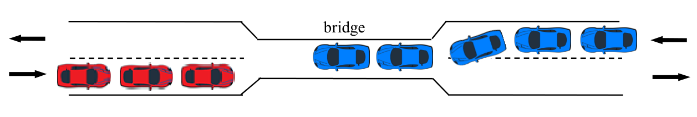

# Narrow bridge

A narrow bridge regulates traffic with the following properties:

* Vehicles from both directions aren't allowed to cross the bridge simultaneously.
* It's not allowed for more than N vehicles to be on the bridge at any times.
* A vehicle shouldn't have to wait forever to cross the bridge, even if there's vehicles coming from the other side non-stop.

This problem is a variation of the Reader/Writer problem.